```mermaid
erDiagram
    %% ========================================
    %% 기존 테이블 (profile_bot)
    %% ========================================

    users {
        bigint user_id PK "디스코드 유저 ID"
        bigint guild_id PK "디스코드 서버 ID"
        bigint total_seconds "총 공부 시간(초)"
        bigint xp "경험치"
        timestamp last_seen_at "마지막 접속"
        text nickname "닉네임"
        varchar student_no "학번 (YYYYMMDD + NN)"
        text status "상태 (active/left)"
        integer level "레벨"
        text level_name "레벨명"
        text profile_image "프로필 이미지 URL"
        text dormitory "기숙사"
        date joined_at "가입일"
    }

    voice_sessions {
        bigint session_id PK "세션 ID"
        bigint user_id FK "유저 ID"
        bigint guild_id FK "서버 ID"
        timestamp started_at "시작 시간"
        timestamp ended_at "종료 시간"
        integer duration_seconds "공부 시간(초)"
        varchar source "출처 (discord/app_timer/app_pomodoro)"
    }

    daily_streaks {
        bigint user_id PK,FK "유저 ID"
        bigint guild_id PK,FK "서버 ID"
        date streak_date PK "출석 날짜"
    }

    %% ========================================
    %% 신규 테이블 (앱)
    %% ========================================

    pomodoro_settings {
        bigint user_id PK,FK "유저 ID"
        bigint guild_id PK,FK "서버 ID"
        integer focus_time "집중 시간(분) default 25"
        integer break_time "쉬는 시간(분) default 5"
        integer repeat_count "반복 횟수 default 4"
        timestamp updated_at "수정일"
    }

    todos {
        bigint todo_id PK "투두 ID"
        bigint user_id FK "유저 ID"
        bigint guild_id FK "서버 ID"
        date todo_date "날짜"
        text content "내용 (max 22자)"
        boolean is_completed "완료 여부"
        integer sort_order "정렬 순서"
        bigint recurring_id FK "반복 투두 ID (nullable)"
        timestamp created_at "생성일"
        timestamp updated_at "수정일"
    }

    recurring_todos {
        bigint recurring_id PK "반복 투두 ID"
        bigint user_id FK "유저 ID"
        bigint guild_id FK "서버 ID"
        text content "내용 (max 22자)"
        boolean is_active "활성화 여부"
        timestamp created_at "생성일"
        timestamp updated_at "수정일"
    }

    diaries {
        bigint diary_id PK "일기 ID"
        bigint user_id FK "유저 ID"
        bigint guild_id FK "서버 ID"
        date diary_date "일기 날짜"
        text content "일기 내용"
        boolean is_locked "수정 잠금 여부"
        timestamp created_at "생성일"
        timestamp updated_at "수정일"
    }

    diary_replies {
        bigint reply_id PK "답장 ID"
        bigint diary_id FK,UK "일기 ID (1:1)"
        text content "LLM 답장 내용"
        timestamp created_at "생성일"
    }

    notifications {
        bigint notification_id PK "알림 ID"
        bigint user_id FK "유저 ID"
        bigint guild_id FK "서버 ID"
        varchar type "타입 (DIARY_REPLY/NOTICE)"
        text title "제목"
        text body "내용"
        boolean is_read "읽음 여부"
        timestamp created_at "생성일"
    }

    device_tokens {
        bigint device_id PK "디바이스 ID"
        bigint user_id FK "유저 ID"
        bigint guild_id FK "서버 ID"
        text fcm_token UK "FCM 토큰 (UNIQUE)"
        varchar platform "플랫폼 (android/ios)"
        timestamp created_at "등록일"
        timestamp updated_at "갱신일"
    }

    notification_settings {
        bigint user_id PK,FK "유저 ID"
        bigint guild_id PK,FK "서버 ID"
        boolean push_enabled "전체 알림 ON/OFF default true"
        timestamp updated_at "수정일"
    }

    %% ========================================
    %% 관계 정의
    %% ========================================

    users ||--o{ voice_sessions : "has"
    users ||--o{ daily_streaks : "has"
    users ||--o| pomodoro_settings : "has"
    users ||--o{ todos : "has"
    users ||--o{ recurring_todos : "has"
    users ||--o{ diaries : "has"
    users ||--o{ notifications : "has"
    users ||--o{ device_tokens : "has"
    users ||--o| notification_settings : "has"

    recurring_todos ||--o{ todos : "generates"
    diaries ||--o| diary_replies : "has"
```

# 마법사관학교 통합 ERD

> profile_bot + 앱 통합 데이터베이스 스키마

---



---

## 테이블 설명

### 기존 테이블 (profile_bot에서 확장)

| 테이블 | 설명 | 변경사항 |
|--------|------|----------|
| `users` | 디스코드 회원 정보 | `profile_image`, `dormitory`, `joined_at` 추가 |
| `voice_sessions` | 공부 세션 기록 | `source` 컬럼 추가 (discord/app_timer/app_pomodoro) |
| `daily_streaks` | 일별 출석 기록 | 변경 없음 |

### 신규 테이블 (앱 전용)

| 테이블 | 설명 |
|--------|------|
| `pomodoro_settings` | 사용자별 뽀모도로 설정 |
| `todos` | 투두 리스트 항목 |
| `recurring_todos` | 반복 투두 템플릿 |
| `diaries` | 일기 |
| `diary_replies` | LLM 일기 답장 |
| `notifications` | 알림 |
| `device_tokens` | 푸시 알림용 FCM 토큰 |
| `notification_settings` | 알림 설정 (카테고리별 확장 가능) |

---

## 핵심 설계 포인트

### 1. 공부 시간 통합
- `voice_sessions.source` 컬럼으로 출처 구분
  - `discord`: 디스코드 음성 채널
  - `app_timer`: 앱 타이머 모드
  - `app_pomodoro`: 앱 뽀모도로 모드
- 캘린더 통계 시 모든 source 합산

### 2. 사용자 식별
- PK: `(user_id, guild_id)` - 디스코드 ID 기반
- 앱 로그인 시 디스코드 OAuth로 연동
- 게스트는 클라이언트 로컬에서 별도 관리

### 3. 일기 시스템
- `diaries.is_locked`: 다음날 06:00 이후 true로 변경
- 답장 노출: 서버에서 시간 체크 (09:00 이후 노출, DB 컬럼 없음)

### 4. 반복 투두
- 매일 00:00에 배치로 다음날 투두 자동 생성
- `todos.recurring_id`로 원본 반복 투두 추적

---

## 인덱스 권장사항

```sql
-- 공부 세션 조회 최적화
CREATE INDEX idx_voice_sessions_user_date ON voice_sessions(user_id, guild_id, started_at);
CREATE INDEX idx_voice_sessions_source ON voice_sessions(source);

-- 투두 조회 최적화
CREATE INDEX idx_todos_user_date ON todos(user_id, guild_id, todo_date);

-- 일기 조회 최적화
CREATE INDEX idx_diaries_user_date ON diaries(user_id, guild_id, diary_date);

-- 알림 조회 최적화
CREATE INDEX idx_notifications_user_unread ON notifications(user_id, guild_id, is_read);

-- 디바이스 토큰 조회 최적화
CREATE INDEX idx_device_tokens_user ON device_tokens(user_id, guild_id);

-- 반복 투두 조회 최적화
CREATE INDEX idx_recurring_todos_user ON recurring_todos(user_id, guild_id);
CREATE INDEX idx_recurring_todos_active ON recurring_todos(is_active);
CREATE INDEX idx_todos_recurring ON todos(recurring_id);
```
